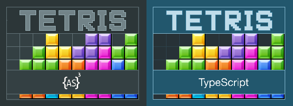
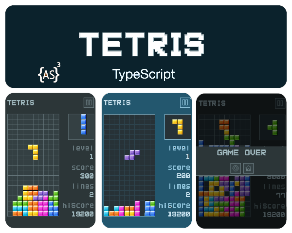

In this repository, you will find the game Tetris developed in different programming languages.

### Status

+ **Actionscript/Starling:** Done
+ **Cocos2d-x/C++:** in progress.
+ **Unity/C#:** to do.
+ **Defold/Lua:** to do.
+ **Phaser/Javascript:** to do.
+ **PixiJS/Haxe:** to do.

* * *

### Demos
+ **[Actionscript](https://ronaldosetzer.github.io/portfolio/open_source/tetris/)**

* * *

### Screenshots

* * *

**Ronaldo Santiago**  - Game Developer [ [portfolio](https://ronaldosetzer.github.io/portfolio/) ]