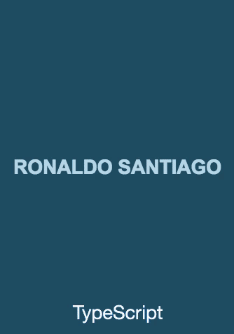

In this repository, you will find the source of the game Tetris, developed in some different programming languages such as Actionscript and TypeScript, following the micro architecture Robotlegs.

### Status

+ **[ActionScript](https://ronaldosetzer.github.io/portfolio/open_source/tetris_as/):** Done.
+ **Haxe/OpenFl:** in Progress.
+ **[TypeScript](https://ronaldosetzer.github.io/portfolio/open_source/tetris_ts/):** Done.
+ **C#/Unity:** to do.

* * *

### Gameplay ActionScript

* * *

### Gameplay TypeScript

* * *

### Demos
+ **[ActionScript](https://ronaldosetzer.github.io/portfolio/open_source/tetris_as/)**
+ **[TypeScript](https://ronaldosetzer.github.io/portfolio/open_source/tetris_ts/)**

* * *

### Screenshots

* * *

**Ronaldo Santiago**  - Game Developer [ [portfolio](https://ronaldosetzer.github.io/portfolio/) ]