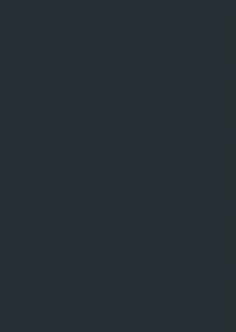
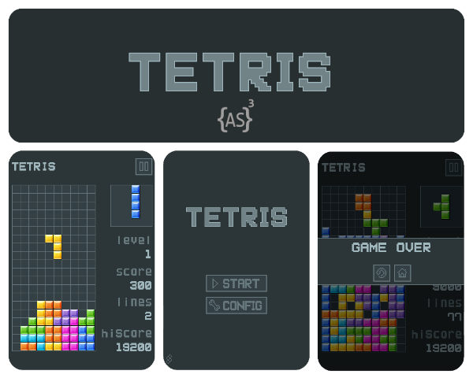

This is an ActionScript open-source game which was developed to shows how to integrate Starling, Robotlegs, and Palidor.

+ **Category:** Puzzle.
+ **Platform:** Web.
+ **Language:** Actionscript 3.
+ **Technologies:** StarlingFW, Robotlegs, Palidor, FlexUnit.


* * *

### Gameplay



* * *


### Dependencies

+ [Starling](https://github.com/Gamua/Starling-Framework)
+ [Robotlegs 2](https://github.com/robotlegs/robotlegs-framework)
+ [Palidor](https://github.com/RonaldoSetzer/robotlegs-extensions-Palidor)
+ [FlexUnit 4](https://flex.apache.org/download-flexunit.html)


* * *


### Demos
+ **[ActionScript](https://ronaldosetzer.github.io/portfolio/open_source/tetris_as/)**
+ **[TypeScript](https://ronaldosetzer.github.io/portfolio/open_source/tetris_ts/)**


* * *

### Game

#### Game Flow


#### Views - Managers - Mediators - Commands


### Palidor Config
#### GameConfig.as
```as3
public class GameConfig implements IConfig
{
    ...

    private function mapCommands():void
    {
        commandMap.map( GameEvent.CREATE_LEVEL ).toCommand( CreateLevelCommand );
        commandMap.map( GameEvent.GET_NEXT_PIECE ).toCommand( GetNextPieceCommand );
        commandMap.map( GameEvent.INCREASE_POINTS ).toCommand( IncreasePointsCommand );
        commandMap.map( GameEvent.GAME_OVER ).toCommand( GameOverCommand );
    }
    private function mapMediators():void
    {
        //Robotlegs
        
        mediatorMap.map( IntroView ).toMediator( IntroViewMediator );
        mediatorMap.map( HomeView ).toMediator( HomeViewMediator );
        mediatorMap.map( ConfigView ).toMediator( ConfigViewMediator );
        mediatorMap.map( GameView ).toMediator( GameViewMediator );
    
        mediatorMap.map( GridComponent ).toMediator( GridComponentMediator );
        mediatorMap.map( NextPieceComponent ).toMediator( NextPieceComponentMediator );
        mediatorMap.map( HUDGameComponent ).toMediator( HUDGameComponentMediator );
    
        mediatorMap.map( StartingPopup ).toMediator( StartingPopupMediator );
        mediatorMap.map( PausePopup ).toMediator( PausePopupMediator );
        mediatorMap.map( GameOverPopup ).toMediator( GameOverPopupMediator );
        mediatorMap.map( ResetConfimPopup ).toMediator( ResetConfirmPopupMediator );
        mediatorMap.map( InfoPopup ).toMediator( InfoPopupMediator );
    }
    
    private function mapFlowManager():void
    {
        // Palidor
        
        flowManager.map( FlowEvent.SHOW_INTRO_VIEW ).toView( IntroView );
        flowManager.map( FlowEvent.SHOW_HOME_VIEW ).toView( HomeView );
        flowManager.map( FlowEvent.SHOW_GAME_VIEW ).toView( GameView );
        flowManager.map( FlowEvent.SHOW_CONIFG_VIEW ).toView( ConfigView );
    
        flowManager.map( FlowEvent.SHOW_STARTING_POPUP ).toFloatingView( StartingPopup );
        flowManager.map( FlowEvent.SHOW_PAUSE_POPUP ).toFloatingView( PausePopup );
        flowManager.map( FlowEvent.SHOW_GAME_OVER_POPUP ).toFloatingView( GameOverPopup );
        flowManager.map( FlowEvent.SHOW_RESET_CONFIRM_POPUP ).toFloatingView( ResetConfimPopup );
        flowManager.map( FlowEvent.SHOW_INFO_POPUP ).toFloatingView( InfoPopup );
    }
    
    ...
}

``` 

* * *


### Screenshots

* * *

**Ronaldo Santiago**  - Game Developer [ [portfolio](https://ronaldosetzer.github.io/portfolio/) ]